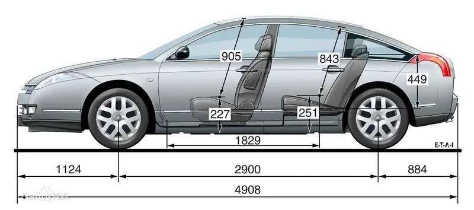

# 汽车分类

## 汽车的分级

### 一、汽车A、B、C、D级汽车划分

汽车等级划分是德国大众汽车对汽车的一种分级方法，主要按照车长、轴距、排量参数进行划分，其中轴距是最主要的划分依据。按照此依据被分为：A00级、A0级、A级、B级、C级、D级车。在国内分别对应为：微型车、小型车、紧凑型车、中型车、中大型车、大型车。随着车型的增加以及价格、款式、配置选择越来越多样化，A级、B级、C级车的边缘交叉也会越来越多。例如，有些车型或许轴距属于A级车范围，而排量与价格却与B级车相差无几。目前，按照A、B、C、D级进行汽车等级划分逐渐在淡化。

| 级别    | 类型   | 车长/米    | 轴距/米     | 排量/升    |
| ----- | ---- | ------- | -------- | ------- |
| A00级车 | 微型车  | 不超过3.7  | 不超过2.3   | 0.8-1.2 |
| A0级车  | 小型车  | 不超过4.2  | 不超过2.6   | 1.0-1.5 |
| A级车   | 紧凑型车 | 4.2-4.6 | 2.5-2.7  | 1.5-2.0 |
| B级别车  | 中型车  | 4.6-4.8 | 2.7-2.8  | 1.6-2.5 |
| C级车   | 中大型车 | 4.8-5.0 | 2.8-2.95 | 2.3-3.0 |
| D级车   | 大型车  | 大于5.0   | 大于2.95   | 大于3     |

__车长__： 可简单理解为车辆的最大长度，如下面这辆车的车长是4908厘米。

__轴距__： 可简单理解为汽车前轴中心到后轴中心的距离。如下面这辆车的轴距是2900厘米。

__排量__： 指每行程或每循环吸入或排出的流体体积。

### 二、轿车、SUV、MPV

下面图片分别是：轿车、SUV、MPV。（简单的讲：SUV是升高的轿车，MPV是拉长的SUV）

__轿车__：通常是典型的四门设计，车身较低，后备箱与乘客室分隔。由于轿车重心低，因此操控性好，相比较于SUV重量轻，在同排量的情况下油耗会低一些。

__SUV__:其英文是`Sport Utility Vehicle`，因此简称SUV。翻译为运动多功能汽车，其底盘更高，空间更大，能适应更多的道路，但是由于其重心较高，高速行驶的操控性不如轿车。

__MPV__:英文是`Multi-Purpose Vehicle`, MVP较为冷门，内部空间较大，一般可乘坐7人，座椅灵活性高，主要用于家庭或商务用途。

## 二、两厢车、三厢车

**两厢车**：两厢车是指少了突出的“屁股”(后备箱)的轿车，它将车厢与后备箱做成同一个厢体。这种布局形式能增加车内空间，多用于小型车和紧凑型车。

**三项车**：三厢车是轿车的标准形式，它的车身结构由三个相互封闭用途各异的“厢”所组成：前部的发动机舱、车身中部的乘员舱和后部的行李舱。

更为详细的车辆级别信息<a href="https://car.autohome.com.cn/baike/detail_7_18_53.html">点击这里</a>
