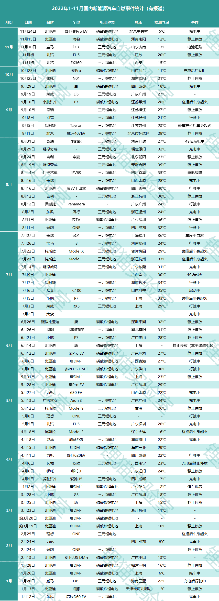

# 2022年部分时间电动车自燃数据

**先说结论：新能源汽车比燃油车更易自燃，且自燃概率是油车的2.5~3倍**

## 一、数据统计

狸猫实验室统计了2022年前三季度中各类网站公开报道过的含具体品牌的国内新能源汽车自燃及起火事件（不完全），并明确标明了自燃时汽车的状态，以及电池种类。

## 二、相关分析

1. 新能源车发生自燃原因五花八门：静止起火、充电起火、行驶起火、碰撞起火。
2. 三元锂电池能量密度高，自燃温度仅有200度，磷酸铁锂自燃温度500-800度，理论上三元锂电池更容易自燃。但是并不能判定三元锂电池不好，相反三元锂离子电池体积小，重量轻，充电快。
3. 电动汽车自燃远比燃油车可怕。电动汽车静止时发生自燃意味着难以及时补救灭火，同时更加危险，电动汽车自燃留给车内人员逃生的时间会更短。假设50度的电动汽车起火，可以释放近2亿焦尔的能量，相当于43公斤TNT炸药。

## 三、奇思妙想

- 电动汽车发生燃烧时不可避免的，只有通过先进的BMS（电池管理系统）才能减少燃烧的概率。

**灵魂拷问：你心中的那个品牌自燃率高吗？**
