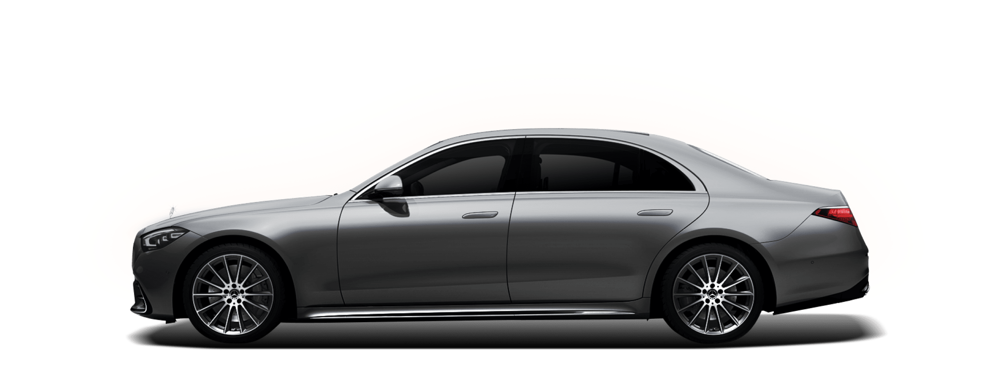
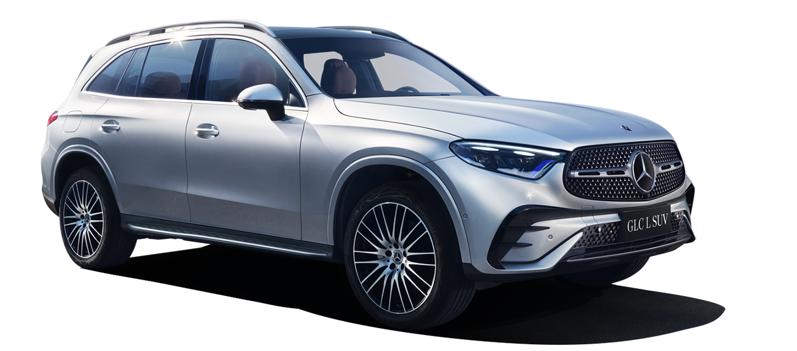

# SUV还是轿车

先说结论：喜欢什么买什么。

## 一、轿车优雅永不过时

如果用一个词语来形容轿车，那一定是“优雅”二字，三厢的轿车更像一个少女，流线型的车身，极地的风阻，除了现实低调、高端、大气上档次外，较低的重心，使他具有更好的操控性，在高速进弯时更具安全性，因此轿车具有：

1. 高端、优雅。所以公务车总是三厢的轿车。
2. 重心低，加速快，过弯稳定性好。
3. 风阻小，车身轻，更省油。
4. 三厢轿车尾箱独立，不串味，路噪好。所以车尾箱放个榴莲，副驾驶的女神是闻不到的。
5. 车身离地间隙低，稍显复杂的路况容易蹭地盘。

## 一、SUV女性的最爱

SUV用中文说就是：运动多功能汽车。通俗一点就是**城郊实用汽车**。

同样的，让我们用一个词语形容SUV，那一定是“猛男”。高大、威武的身姿给你足够的安全感，居高临下的视野让你感觉我就是那颗最亮的星。因此SUV具有：

1. 高大，霸气。给足女性足够的安全感觉。这仿佛和谈恋爱异曲同工之妙，女性往往更喜欢“猛男”，尽管他重心不稳，身体不够灵活。
2. 底盘高，较高的离地间隙能够适用于更多复杂的路况。
3. 视野好，相比较于轿车其较高的车身，能够看得更远。
4. 安全性好。较大的内部空间相比较于轿车能够有更好的碰撞缓冲。
5. 风阻大，操控性差，不适合跑高速。
6. 车身重，油耗高，百公里加速相比较同级别轿车慢。

## 三、奇思妙想

- 我想你并不会把SUV开到显现操控性不好的速度，也并不会真在碰撞的时候说轿车安全性不好。
- 我想你不会在意SUV百公里加速慢，也不会觉得轿车省油。

回归本质：外观是轿车和SUV最大的区别，选择你所喜欢的，如此简单。

**灵魂拷问：你真的会因为轿车的优点放弃选择SUV吗？ 你真的会因为SUV的优点放弃选择轿车吗？**