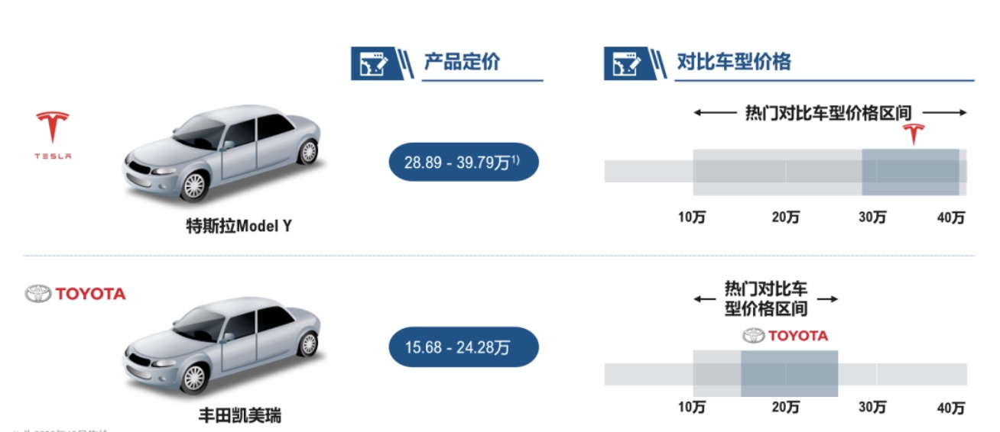

# 买车是鸡头还是凤尾

先说结论：推荐选择凤尾。选择鸡头牺牲更好的架乘体验换取丰富的配置。选择凤尾获得更好的驾乘体验。

## 一、汽车中的鸡头凤尾

汽车中的鸡头凤尾有两个意思：

1. **同品牌**的鸡头凤尾，例如同为奥迪汽车的A3高配和A4的低配。
2. **不同品牌**的鸡头凤尾，例如某低端品牌的高配和高端品牌的低配。

说到鸡头凤尾，那你知道汽车厂商在定价策略上的心理学吗？

汽车厂商对于自家的各个车型系列在定价上往往覆盖从低到高的价格区间，不留断档，这样一个低级别的车和一个稍高级别的车往往在价格区间上就会有重合。

举个例子：小帅预算25万购置一辆奥迪A3，加上税费保险30万落地。但是很快小帅发现A3低配版天窗和真皮座椅都没，空调也得手动调节。感觉不如买高配版的A4系列，可是又发现稍微加点钱就可以买尺寸更大的A4L（加长版）。于是销售一顿忽悠：你把预算从25万提高到了28万，可是现奥迪A6L低配版32万就能买到了，小帅又不知道怎么选了。

汽车厂商深谙心理学：绝对不会让某一款车特别具有吸引力，而让其他车型失去竞争力。

- 

## 二、回归本质，做出选择

1. 汽车行业中有严格的尺寸级别划分，汽车级别高出一档，其综合品质就业有一个质的提升。更多表现在无法直观看到的**安全级别、动力级别、稳定性**等。因此无疑是凤尾是较好的选择。

2. 来个更难选择题：不同品牌、不同级别混杂在一起怎么选择？

   例如豪华品牌奥迪A3和大众品牌迈腾，这两个该怎么选呢？这个就要看自己的实际需求，自己的喜欢。毕竟迈腾也不差，还有更大的空间。

## 三、温馨提示

- 坚定预期和预算
- 电动座椅、自动泊车、自适应巡航这些不经常用的配置，在预算紧张时要多考虑考虑长时间不用的配置，需要为此付费吗？有些东西偶尔手动调节一次也没关系不是。

**灵魂拷问：真的能坚持自己的预算吗？**