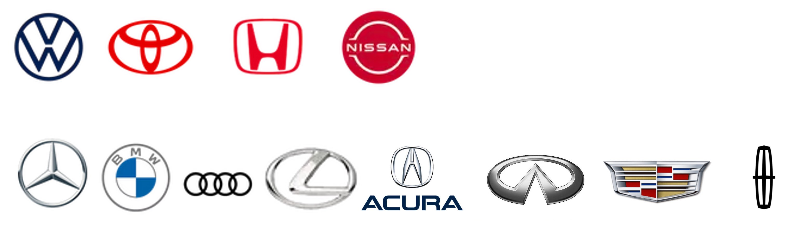

# 亲民品牌还是高端品牌

先说结论：买车像娶妻要门当户对

## 一、高端的本质

在买油车还是电车一文中我曾发出灵魂拷问：车的本质是什么。我的答案是**代步工具**。那品牌的本质是什么呢？是**标签**，高端的本质就是更高端的标签和更高端的圈子。2017年高度根据大数据得出：“奔驰车主爱火锅，宝马车主爱购物，凯迪拉克车主爱洗浴中心。” 因此当你考虑亲民品牌还是高端品牌时，那要想一下想为自己贴什么标签，或者自己该具备什么样的标签。

##### 如何判断一个品牌是否是高端品牌？

1. 比较该品牌卖出的高级别车型和低级别车型的数量，高级别车型销量大的更能说明该品牌是高端品牌。下面列举部分平民品牌和高端品牌车型。

- 平民品牌：大众、丰田、本田、日产等接地气被绝大多数人选择的。

- 豪华品牌：奔驰、宝马、奥迪、雷克萨斯、讴歌、英菲尼迪、凯迪拉克、林肯等

## 一、高端汽车需要一些代价

1. 质量是豪华品牌的基础，但决定豪华品牌的一定不是质量，而是其特有**用户标签**和**用户体验**。因此不要认为买了豪车，它的质量一定比亲民车更好。
2. 高端品牌的汽车不但其车身价格昂贵，它的保险、保养、维修更是需要不菲的支出。
3. 档次越高，性价比越低。

## 三、奇思妙想

- 如果汽车只是代步工具、不能为你带来收益，或许选择亲民品牌更好。
- 如果汽车是赚钱、社交的工具，或许高端品牌才是你需要的。

**灵魂拷问：你买车仅仅是为了代步吗？**