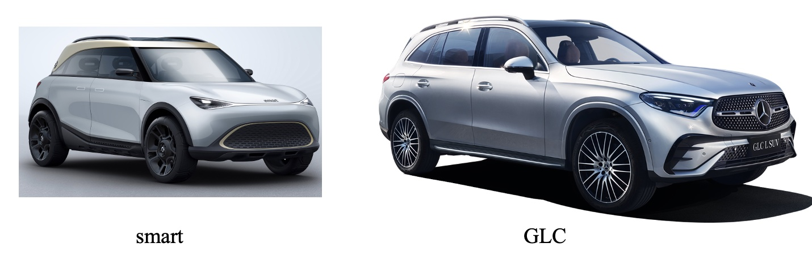
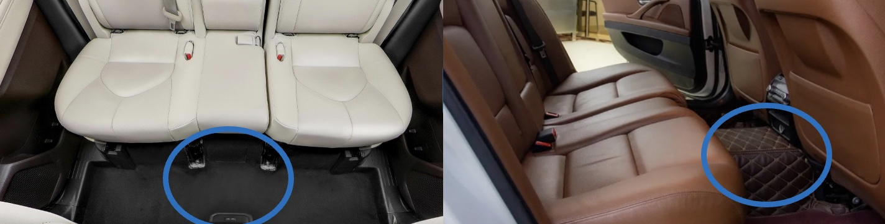

# 大车还是小车

**先说结论：根据自身需要，选择车型。**

## 一、基础知识

在基础知识<a href="../basics/汽车分类.md">汽车分类</a>这篇文章中介绍汽车等级的划分以及三厢车、两厢车的区别，建议先浏览<a href="../basics/汽车分类.md">汽车分类</a>再继续向下阅读。

## 二、大车天然被宠爱

似乎没有人不喜欢大车，在选车时如果预算允许，更多的人愿意选择大一点的车，这或许是有一定的理由，比如：

1. 大车内部有更大的缓冲和溃缩空间，相对安全。
2. 轴距更长的车具有更好的直线性能，轮距更宽的车横向更加平稳。简单讲就是：打车更平稳舒服，小车更颠簸灵活。

但是你并不需要为了大车的这些优点而选择同等价位普通级别大车而放弃豪华级别的小车。

## 三、外形尺寸大并不一定代表车内空间大

在车内部空间的设计上分为两个流派，一个是日系流派，另一个是欧系流派。

1. 日系流派：车内地板平坦，车底凸起。
2. 欧系流派：车底平整，车内地板凸起。

日系流派的设计，车内乘客会有更好的乘坐体验，舒适性会更好。欧系流派的设计，车辆的运动性能和空气动力学会更好。

但是我猜你会更多的考虑乘坐体验，你真的会考虑运动性能和空气动力学吗？ 

除此之外，日系和欧系的车内设计理念也有很大差异。

1. 日系流派：横向肘部尺寸宽敞，坐起来会更加宽松。
2. 欧系流派：包裹性较好，即使车内空间较大，强烈的包裹性依旧让你忽略了宽松的内部空间。

## 三、奇思妙想

- **灵魂拷问：小车真的没有优点吗？**

