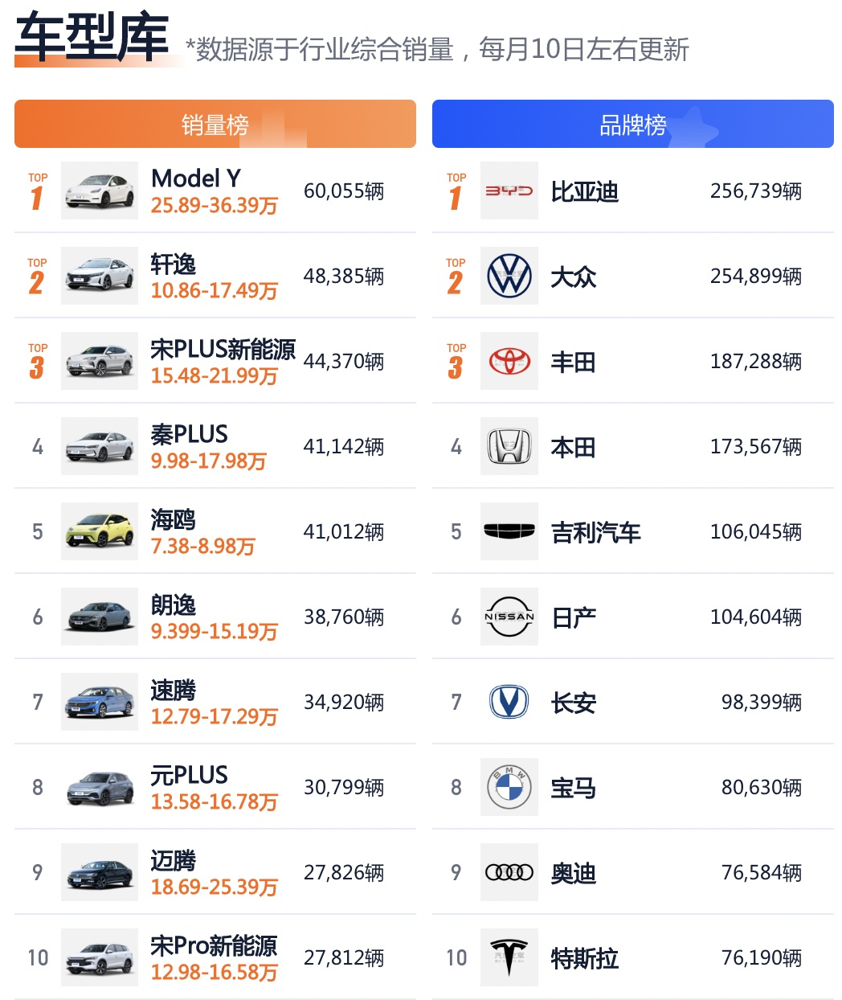

# 小白选车

先说结论：定需求------>卡预算------>大牌子------>销量好------>选定。

## 一、选车步骤

1. 定需求：复杂路况SUV、城市道路轿车；自驾游SUV，商务选轿车。家庭成员尽量全覆盖，五口之家几乎随便选，带上老人MPV。
2. 卡预算：如果车子仅仅是出行工具，明确承受范围，考虑购车成本与每年养护费用。
3. 大牌子：大牌车企历经长时间积累，技术有保障，信誉有保证，售后相对可靠。不至于买了某些牌子的车保险无法购买，这岂不是一堆废铜烂钱。
4. 销量好：汽车的质量、保值率、维护成本等与销量有很大关系，选择大家所选，做大最大程度省心，因为你遇到的问题都有人遇到过，不至于维修，维权困难。

## 二、温馨提示

- 销量好，一定是单车销量好。
- 好车不等于豪车，豪车不等于质量好。

  

**灵魂拷问：现在你知道什么车是好车了吗？**