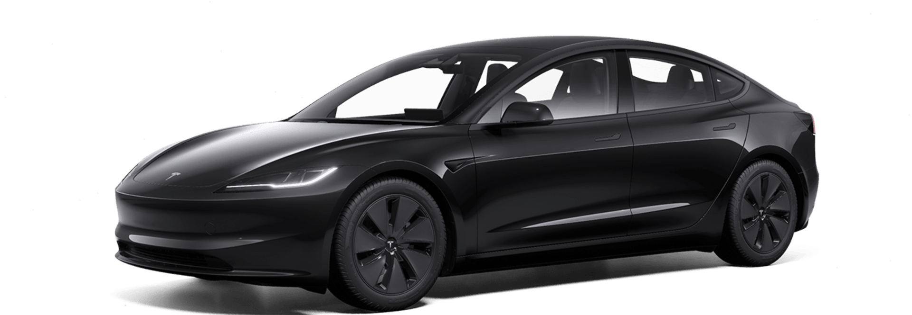

# 买油车还是电车

先说结论：选择可靠买油车，选择智能化买电车。

## 一、买油车的理由

1. 油车可靠性高。油车经过几十年的发展，发动机、变速箱、底盘系统已经发展的相当成熟。汽车坏掉的几率会小的多。
1. 油车没有里程焦虑。三两分钟加箱油，重新满续航。
1. 便宜。当前电动汽车的发展使油车不断降价，购买油车价格更低。
1. 保险费便宜。

## 一、买电车的理由

1. 使用成本低。由于电费较为便宜，百公里花费仅二三十元。
1. 智能化程度高。当前的电车普遍具有智能座舱，更像一个移动的家。
1. 加速快。
1. 可外接电器，更适合野餐。

## 三、奇思妙想

- 燃油车最终一点会被新能源汽车替代，但新能源汽车不只有电动汽车，还有氢燃料电动汽车等。未来终极的新能源汽车是什么，我们不得而知。
- 在燃油汽车向电动汽车转变的过程中，混动汽车作为一款过度产品，似乎是一个不错的选择。
- 如果生活不是很富裕，那一定是油车，省心。
- 如果是第一辆汽车，那么也一定是油车，靠谱。
- 如果生活需要更精彩，那一定是电车。

**灵魂拷问：车的本质是什么？**