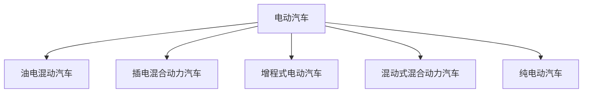

## 电动汽车包括哪些类型

先说结论：电动汽车种类分为HEV、PHEV、SHEV、PSHEV、EV。

### 一句话概括不同电动汽车类型

油电混动汽车：具备燃油驱动和电动驱动系统，过优化两者之间的协同工作的汽车，不能外接充电。

插电式混合动力汽车：可外接充电的油电混动汽车。

增程式电动汽车：发动机给动力电池充电，通过电动机驱动的汽车，可以外接充电。

混动式混合动力汽：综合了插电式混合动力和增程式的电动汽车。

纯电动汽车：纯由动力电池给电动机供电的电动汽车。

1. “油电混动”（HEV）：同时具备发动机和电动机，在车辆低速运行时电动机工作，在车辆高速时使用发动机工作，使发动机维持的最佳工作状态，从而带来良好的动力性能，有效减少燃油消耗。另外，动力电池依靠发动机进行充电，往往没有外接充电口。
2. “并联式混合动力汽车”（PHEV）：也叫**插电式混合动力汽车”**，和它名字一样，插电式混合动力汽车可简单认为是在“有点混动”汽车基础上增加了给汽车动力电池充电的系统。它具备两套完整的驱动系统，不仅有传统燃油汽车的发动机、变速箱、油箱等部件，还有纯电动汽车的电池、电动机等部件。它可以单独使用电力驱动，也可单独使用燃油驱动，甚至可以相互叠加。一般会有纯电模式、纯油模式、混合驱动模式可供选择。但是整车往往较重，油耗较高。
3. “串联式混合动力汽车”（SHEV）：也叫**增程式电动汽车**，发动机只给汽车电池充电，电动机依靠动力电池驱动汽车行驶的汽车。相当于发动机是汽车的移动充电器，汽车可以通过充电桩充电也可通过发动机充电。当发动机供电时，发动机将燃油转换成电力，电力再驱动汽车，此时油耗升高。
4. “混动式混合动力汽车”（PSHEV）：有两个电机，一个电机专职直接驱动车轮，另一个可以驱动车轮，也可以充当发电机给蓄电池充电。它同PHEV一样有两套动力系统，但是可用一个电机回收制动、怠速时的能量和发电机产生的能量来给电池充电。PHEV由于只有一个电机，因此只有在燃油驱动时才能将电动机当作发电机来给电池充电。
5. “纯电动汽车”（EV）：完全由电动机消耗动力电池带动行驶的汽车。

视频讲解点<a href="https://car.autohome.com.cn/baike/detail_7_18_1149.html">点击这里</a>